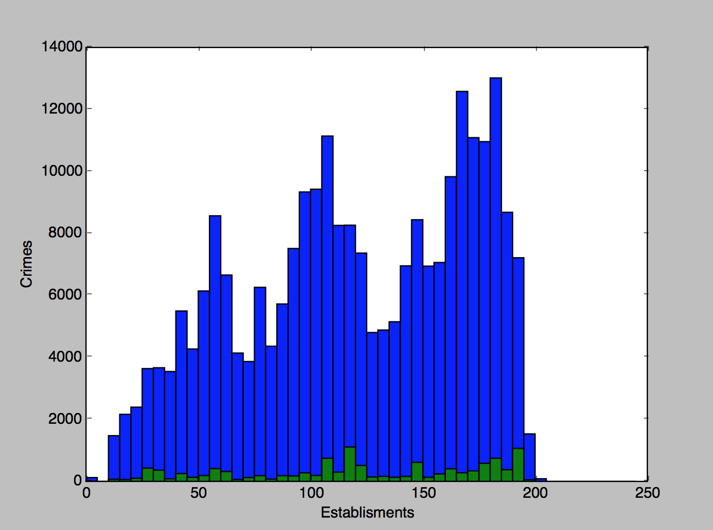
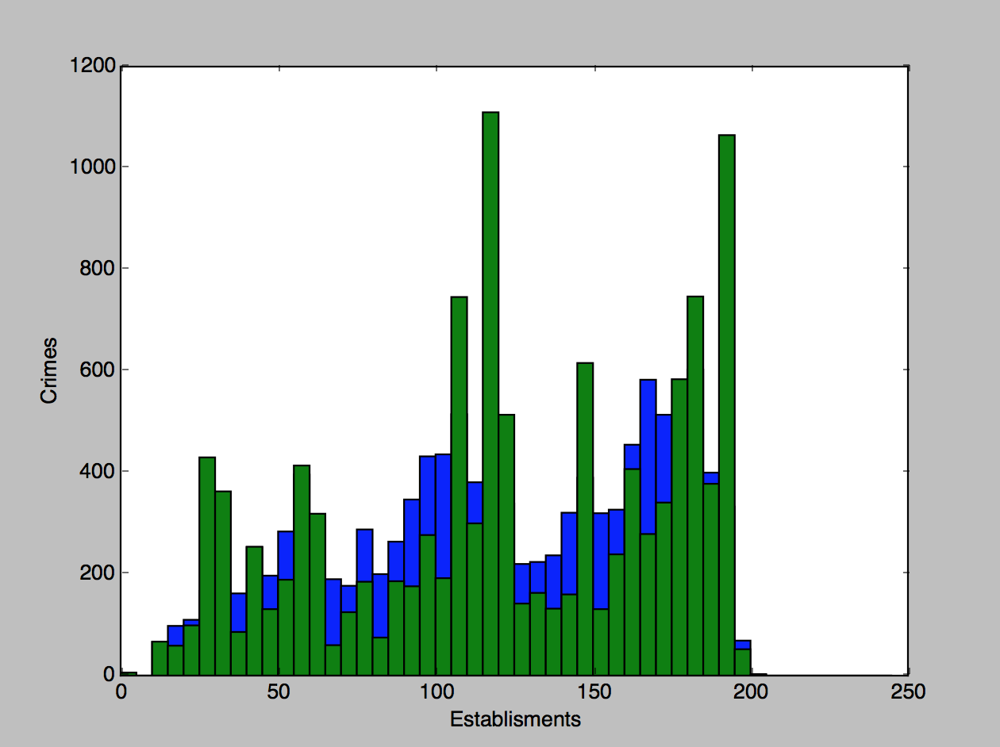
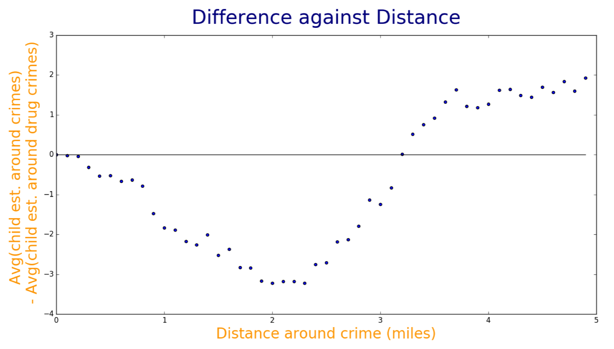
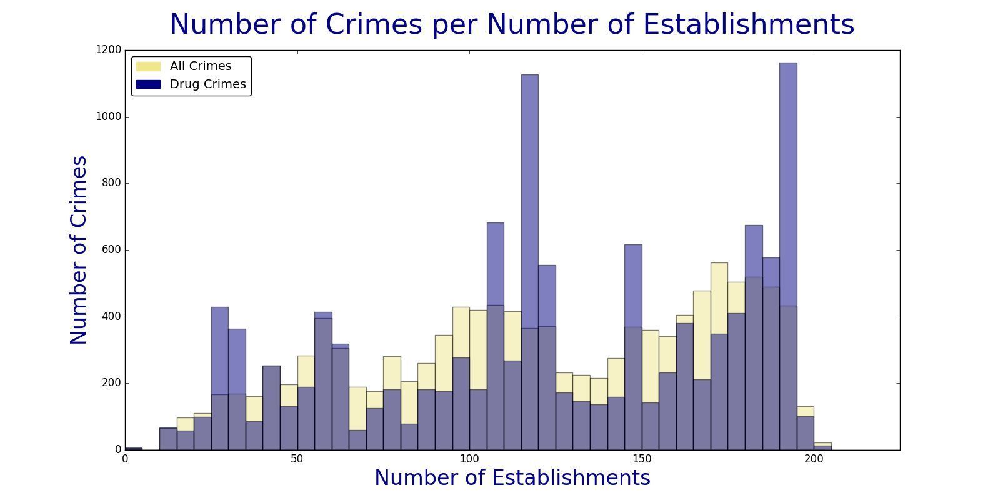

#Project Part 1
We are interested in determining whether or not children dedicated establishments in Boston have less drug crime incidents. We plan on analyzing the proximity of the drug crime incidents to all public schools, private schools, day camps, child feeding programs, private daycares and public daycares. With this data, we can create visualizations in the form of histograms whose data can confirm if there is a definite correlation between any of these children establishments and drug crimes.

#Data Sets
Legacy Crimes: https://data.cityofboston.gov/Public-Safety/Crime-Incident-Reports-July-2012-August-2015-Sourc/7cdf-6fgx

Current Crimes: https://data.cityofboston.gov/Public-Safety/Crime-Incident-Reports-August-2015-To-Date-Source-/fqn4-4qap

Public Schools: http://bostonopendata.boston.opendata.arcgis.com/datasets/1d9509a8b2fd485d9ad471ba2fdb1f90_0

Private Schools: http://bostonopendata.boston.opendata.arcgis.com/datasets/0046426a3e4340a6b025ad52b41be70a_1

Public Daycares: https://data.cityofboston.gov/dataset/City-Day-Care/q6h3-7rpz/alt

Private Daycares: https://www.care.com/day-care/boston-ma

Day Camps: https://data.cityofboston.gov/dataset/Day-Camps/sgf2-btru

Children Feeding Programs: https://data.cityofboston.gov/Human-Services/Children-s-Feeding-Program/p9yd-36dn

To get these datasets: `$ python3 project#1/getData.py`

(getData.py calls the python module scrapePrivateDaycares.py which requires selenium. To run the webscraper, download the Chrome webdriver at: https://sites.google.com/a/chromium.org/chromedriver/downloads and on line 13 of scrapePrivateDaycares.py please make sure to input the path to the downloaded chrome driver as an argument for the webdriver. Example: driver = webdriver.Chrome("C:/Users/Test/chromedriver.exe")

#Transformations
Transformation 1: The first transformation merges all the Legacy and Current crimes data sets. This will create a consolidated dataset that merges the old and new crime datasets from the city of Boston. We will be only selecting the locations of the crimes and merging them on their type of crime. The resulting dataset will be a consolidated dataset of all the crimes in Boston from July 2012 to current with their locations and whether or not they are a related crime. This creates the allCrimesMaster dataset.

To run this script: `$ python3 project#1/mergeAllCrimes.py`

Transformation 2: The second transformation is similar to the first except it only grabs the crimes that are not drug related and puts them in their own dataset. This creates the noDrugCrimesMaster dataset.

To run this script: `$ python3 project#1/mergeAllWithoutCrimes.py`

Transformation 3: This third tranformation is also similar to the first. It only grabs the crimes that are drug related. This creates the allDrugCrimesMaster dataset.

To run this script: `$ python3 project#1/mergeDrugCrimes`

Transformation 4: This tranformation merges the public school and private school datasets. This will select the school name and location while preserving if the school is private or public. Because some of the latitue and longitude values were unavailable, their latitudes and longitudes were converted from their physical adresses using the geopy package. This creates the schoolsMaster dataset.

To run this script: `$ python3 project#1/mergeSchools.py`

Transformation 5: This transformation merges the day camps, public daycares and private daycares datasets while just selecting certain columns from the child feeding programs dataset. It merges the day camps, public daycares and private daycares and preserves name, type of establishment and location. Location and name are selected from the child feeding programs dataset. This script creates the childFeedingProgramsTrimmed and dayCampdayCaresMaster datasets.

To run this script: `$ python3 project#1/mergeChildren.py`

#Run Instructions

`$ python3 project#1/getDataAndMerge.py`

#Project Part 2

We intend to see whether a correlation exists between certain establishments associated with children and proximity to drug crimes. Pulling data from the Private Schools, Public Schools, Child Feeding Programs, Day Camps, Public Daycares, Private Daycares, and Crimes data sets gives us the location in address or latitude and longitude format of an establishment or crime. We intend to then take each crime, drug related or not, and find the frequency of each type of establishment within a specific distance/radius to the crime. Then we take each drug related crime and find their frequencies within the same distance. Then we want to compare these two by plotting frequencies for each type of establishment on histograms. The goal is to find, while comparing the histogram with all crimes against the histogram with only drug crimes, a contrast in the peaks of the histograms. This will point to a correlation between the specific type of establishment and drug crimes. We also intend to implement an optimization function to optimize the size of the radius which dictates how many establishments will be within range to be counted in the frequencies. The optimization function will give us a specific distance which will create the largest or most obvious difference in peaks on the histograms we create.

#Run Instructions
Running `$ python3 project#2/prepData3.py` will run prepData1.py and prepData2.py. But they will only iterate through integer radius values (1-6). Also it will only output the averages as a result. It does not save the distributions for later usage. Running this sequence:
```
$ python3 project#2/dataForOptimization.py
$ python3 project#2/megaMapReduce.py
$ python3 project#2/averaging.py
```
This will run the same calculations but with the precision of 0.1 miles. This way, we can check the averages from range(0,5) incrementing by 0.1 miles. This will create new collections in the mongo dabatabse for every radius. This way when we found the optimal radius, we were able to just reference the corresponding collection in the database.

#Analysis
prepData1.py: This script takes an argument r and the allCrimesMaster, allDrugCrimesMaster, childFeedingProgramsTrimmed, dayCampdayCaresMaster and schoolsMaster datasets. Then, using r as a distance, takes every single crime in the allCrimesMaster data set and finds the frequency of the different types of establishments found within that distance. These frequencies are then put into the numberOfEstablishmentsinRadius dataset. The same thing is done to the allDrugCrimesMaster dataset but creates the numberOfEstablishmentsinRadiusDrug dataset

To run this script: `$ python3 project#2/prepData1.py`
Note: execute function is commented out here to allow for function call with parameter by prepData3.py

prepData2.py: This script takes the two datasets created by prepData1.py. It implements a map reduce function on each that returns a distribution of the number of crimes that have x children establishments within the specified proximity from prepData1. It will also have a product of the crimes by establishments with an appended temporary variable used to collapse the data in the reduce function. Another map reduce is applied on the resulting datasets of the above map reduce to produce the total sum of establishments around each crime and the total sum of crimes. Using these values, the average number of establishments around each crime is calculated.

To run this script: `$ python3 project#2/prepData2.py`

prepData3.py: This script functions as a wrapper around prepData1 and prepData2. It iterates through a range of distances to pass to prepData1. It will execute prepData1 with the specified distance, then execute prepData2, and finally calculate the averages of the frequencies of all crimes near the specified establishments compared to just drug crimes near the specified establishments. Using the data here, we are capable of pin pointing the optimal distance to use when running a linear regression on the proximities. 

To run this script: `$ python3 project#2/prepData3.py`

#Results

Optimization Function:

```
value of d: 1
avg_all: 36.30665612960585
avg_drug: 38.260169491525424
diff: -1.9535133619195761

value of d: 2
avg_all: 119.08479304553985
avg_drug: 122.2272033898305
diff: -3.142410344290653

value of d: 3
avg_all: 222.20275017287366
avg_drug: 223.4477966101695
diff: -1.2450464373

value of d: 4
avg_all: 322.10269682900326
avg_drug: 320.82872881355934
diff: 1.273968015443927

value of d: 5
avg_all: 405.74762817346635
avg_drug: 403.215
diff: 2.532628173466379

value of d: 6
avg_all: 465.5048661463993
avg_drug: 463.62127118644065
diff: 1.88359495996
```

With regards to the optimization results, we chose to work with a value of 2 miles when finding the number of children associated establishments around each crime. This was because it was at this integer that the average number of establishments around each drug crime was much greater than the number of establishments around all crimes. In the future, we plan to find the optimal distance by testing distances of 0.1 mile increments.


Linear Regression results for all crimes vs number of establishments for each crime:
0.8706

Linear Regression results for drug crimes vs number of establishments for each crime:
0.4711

This is more or less as predicted since the data is not linear, but it seems that all crimes have a greater correlation to the number of establishments compared to drug crimes.


Histogram:



Normalized Histogram:




Trial Mode:
If you want to run the trial mode, go to getData.py and uncomment out line 197: getData.execute(True) and comment out line 198: getData.execute(). Then follow the run instructions. 

#Project Part 3: Final Report

#Introduction

Drug crime among youth population is a major concern in any major urban populace. People find the possibility of such crimes occurring near children to be a disconcerting reality. However, when said metric is overlayed into city geography, it becomes rather difficult to extrapolate meaningful information.

#Project Goals

Our projects goals can be split into two major tracks:
Find the distance at which the difference between the number of child establishments surrounding each drug crime and the number around each standard crime is maximised.
At this distance, find if a relationship exists between the number of such establishments and the number of drug crimes.

#Data

Crime Datasets: Primary dataset was a consolidation of the legacy crimes dataset (July 2012 - Aug 2015) and the current crimes dataset (Aug 2015 - present) found on the data.cityofboston.gov portal.
Child Establishment Datasets: Supplementary datasets contain the locations of establishments that children frequent including public and private schools, public and private daycares and child food services found on the city portal and through web scraping. 

#Objective Function

max(|average number of child establishments within r distance of any crime - average number of child establishments within distance r of drug crimes|)

After first running the optimization for project 2 with integer radius values, we found the radius of 2 miles to be the optimal radius for our analysis. For further confirmation, we decided to be more precise with our radius measurement and incremented by 0.1 instead of 1.

The following steps were implemented for each radius value r in range(0, 5) miles to a precision of 0.1 miles.

#Step 1

For each crime and drug crime, find the number of child establishments within radius r.

#Step 2

Reduce data from Step 1 to show the number of all crimes with x child establishments and number of drug crimes with x child establishments.

#Step 3

Reduce data from Step 2 to show the average number of child establishments around every crime and every drug crime.

#Step 4

Plot the difference between the average number of establishments around all crimes and average number of establishments around drug crimes.

#Objective Function Results



To run this visualization run `$ python3 project#3/visualisationScatter.py`

|Radius|Absolute Difference|
|------|------------------:|
| ...  | ...			   |
|1.8   | 2.845			   |
|1.9   | 3.169             |
|**2.0**   | **3.225**     |
|2.1   | 3.178             |
|2.2   | 3.184             |
| ...  | ...			   |


The radius of 2 miles has the largest absolute difference and therefore is the optimized value for our analysis. The computations for this portion were the heaviest in our project. For every single crime, we summed up the number of child establishments within each incremented radius. The average computation time for each mile was about two and half hours. 

Data from radius > 5 trended towards constant values as distance approaches Boston boundaries.

#Regression

We ran two OLS analysis using the statsmodels.api package with the optimized distance found in the objective function: 2 miles.

The first compared the total number of establishments with a specific number of all crimes within its radius. 
For example, a data point in the format: {value : {crimes: 576, total: 27}} means that there are 27 establishments with 576 crimes within its 2 mile radius.

The second analysis compared the total number of establishments with a specific number of drug crimes within its radius. We also created a histogram to visually represent the differences between the normalized number of crimes to number of establishments.

#Regression Results

|           |Correlation Coefficient|R-squared Value|
|-----------|-----------------------|---------------|
|All Crimes |0.471					|0.775     	    |
|Drug Crimes|0.186					|0.273			|



To run this visualization run `$ python3 project#3/visualisation.py`

#Conclusion

We can see that there are two peaks in our histogram of Number of Crimes per Number of Establishments. These two peaks represent that there are about 1100 crimes with around 125 children establishments in its radius and there are about 1100 crimes with around 190 children establishments in its radius. We suspect that these peaks are a result of a hotspot of crimes within the optimized radius. 

Our hypothesis at the beginning of the project was that proximity to child establishments would be positively correlated with the number of drug crimes within our optimized radius. However, based on our regression analysis we can conclude that our hypothesis was not correct. There is a larger correlation between all crimes and number of child establishments than between just drug crimes and number of child establishments. So all we can conclude is that there is no correlation between drug crimes and proximity to child establishments. We suspect that this is due to unreported drug crimes around child establishments.

#Future Work

For the Objective Function, the data points represent a definite pattern. Further work involves trying to find the best fit equation of this pattern. Explanations for why avg(establishments per crime) overtakes avg(establishments per drug crime) at radius 3.3 also seems like an intriguing avenue to explore. Also, if we could possibly obtain the ages of the perpetrators of each crime, we could have possibly analyzed how age has a play in all of this.
