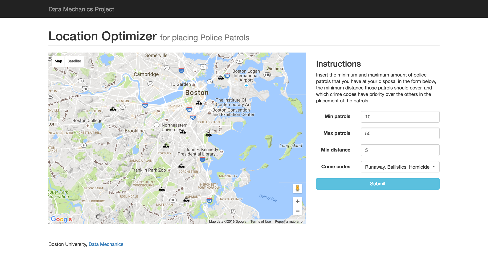
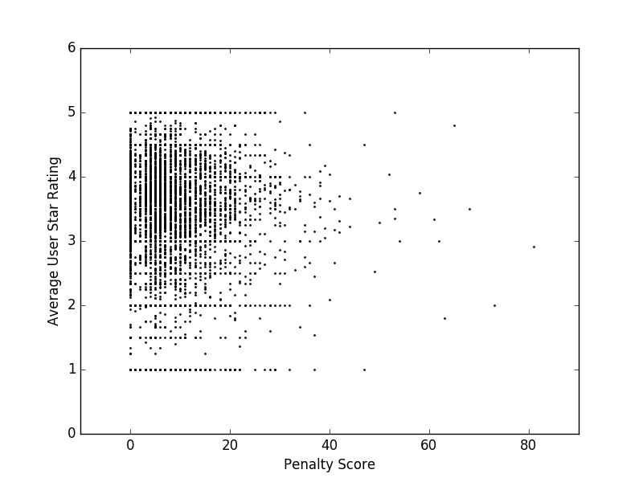

# Title

Stephanie Alibrandi, Javier Arguello

## 1. Introduction

Summarizing this project had multiple objectives, all focused on either ranking or improve city services.

* The main objective of this project is to find a way of optimizing the location of Boston Police Patrols across the city, and to make that implementation flexile enough so that the user can input parameters such as the maximum and minimum patrols the city can afford.
* Secondly, to find wether the Yelp user reviews are correlated with the penalty score given to the restaurant after an inspection.
* Finally, to rank the Boston's zip codes using a multi-objective query that takes into consideration several attributes.

The rest of this report is structured as follows: first, in section 2, the datasets used are enumerated. In section 3 all the preprocessing steps performed over the data are described. In section 4 the techniques applied in order to solve the problems enumerated above are highlighted. Section 6 summarizes the results obtained after applying the techniques of section 5. Finally in section 7 and 8 we present our conclusions and future work.

## 2. Datasets

For the purposes of this project, mutiple datasets were used and combined. Most of them were retrieved from The City of Boston Open Data portal:

* [Crime Incident Reports]
* [School Grounds]
* [Hospital Locations]
* [Food Establishment Inspections]
* [311, Open Service Requests]

Also, for the statistical analysis conducted, the [Yelp Academic Dataset] was used, more concretely a subset containing these two collections:

* Yelp business reviews
* Yelp business

## 3. Preprocessing

The preprocessing steps were performed based on relational data and map-reduce paradigm. More details on how these were used in order to obtain the resulting datasets can be found in the ```README.md``` file along with the instructions on how to run the source code. On the following sub-sections the preprocessing performed will be described in a high level.

### Standarize geographical information

Since location (latitude and longitude) is an important feature we are exploiting in this project, the first preprocessing step was to standarize the geographic information. The resulting JSON structure is the following 

```json
"geo_info": {
    "type": "Feature",
    "properties": {
        "zip_code": 02215
    },
    "geometry": {
        "type": "Point",
        "coordinates": [-71.00, 42.00]
    }
}
```

### Populating zip codes

Almost all datasets in addition to the latitude and longitude, had the zip code information, except for the Crime Incident Reports. In order make a ranking over the zip codes while taking into account the crimes, it is crucial to also incoporate the zip code on the Crime Incident Reports dataset.

There is enough information in the other datasets to populate a significant percentage of the Crime Incident Reports dataset.  Based on this premise, it is possible to build and index over that geographical data, and later given the two coordinates from each crime entry it is possible to find an entry within 1 Km range and assign its zip code.

### Grouping 

After populating the zip codes, it is possible to aggregate some important attributes between all these datasets to later be able to rank the zip codes. That is, having this data we can derive a new dataset with the following structure:

```
(zipcode, #crimes, #311 reports, #passed food inspections, #schools, #hospitals)
```

### Merging the datasets

After gathering the data and to help speed-up the join process two indexes were created:

* Geographical index over location information of the Yelp Business dataset.
* Index over the ```business_id``` of the Yelp Reviews dataset.

For each entry in the Food Inspection dataset, it was mandatory to determine which business it corresponded with respect to Yelp data. To perform this we matched entries in both datasets by ```businessname``` and resolved ties by location: associating the closest restaurant found by latitude and longitude. The Yelp Business dataset contains 1689 distinct business names, while the Food Establishment Inspections dataset contains 6406. As it is natural to assume, these names are not in the same format. That is: Yelp could have McDonald's as the business name while the Inspections have it listed ad MC Donalds. Over the 452112 inspections we were able to combine approximately 64000 (which represents the 15% of the dataset).

The following step was to group all inspections by ```business_id``` and ```date```. The attribute ```viollevel``` was aggregated sice the correlation study will be strongly related to the penalty score.

The final step of the merging process was to associate a group of reviews to a given inspection. For each inspection, we found all the reviews associated with that ```business_id``` between the previous inspection date and the current inspection date.  The final per entry structure of the merging process is the following:

```json
{
    "_id": {
        "business_id": "XXXXXXXX",
        "date": "MM/DD/YYYY"
    },
    "reviews": [{
        "text": "some random text about the food",
        "date": "MM/DD/YYYY",
        "stars": 3
    }],
    "viollevels": [1, 2, 3, 1],
    "business_name": "Example restaurant"
}
```

## 4. Methodologies

In this section the methodologies used to solve the problems introduced in the Introduction are described. First, we use k-means in order to minimize the distances between the Police Patrols and the selected crimes. Second, we compute the *Pearson Correlation Coefficient* between Yelp reviews average rating and the penalty score of the Food Establishment Inspections to determine whether there is a correlation between these two attributes. And finally we use a *skyline query* to solve the multi-objective query of ranking Boston's zip codes.

### Minimizing the distance between police patrols and crime locations

Given the location of the crimes, an interesting application is to find the minimum number of police patrols and where should these patrols be located in order to minimize the distance between these patrols and the historic crime locations. Also, it is possible to select a subset of crimes from the overall dataset. That is, to select a list of codes to give priority to, as an example: giving importance to *robbery* and *shooting* but ignoring *towing cars* and *evading fares*. The minimum patrols needed to fulfill the constraints and the approximate locations can be found using **k-means**.

For this problem user input is used to define what types of crimes should have priority, the minimum distance between these new added patrols and the crime locations, and the minimum/maximum amount of patrols that can be allocated for this purpose.

### Finding correlation between reviews and penalty score of the inspections

Given the [Food Establishment Inspections] dataset and the [Yelp Academic Dataset] we want to determine if there exists a correlation between the average ratings given by the users of Yelp and the penalty score given by the inspectors. These results could be used in the future to determine whether the reviews can be used to predict if a given restaurant might fail a future inspection.

First, is important to define the *penalty score* of a restaurant. Let *b* be a business in the Food Establishment Inspections dataset, inspected at a time *t*, then the penalty score of *b* is defined as follows:

penalty<sub>b</sub> = minor<sub>b</sub> + major<sub>b</sub> + severe<sub>b</sub>

where minor<sub>b</sub>, major<sub>b</sub> and severe<sub>b</sub> are minor, major and severe violations (which in the dataset are represented as strings '\*', '\*\*', '\*\*\*').

To perform the correlation analysis, the data was partitioned by date. We defined a window of time between two inspections *i* and *i+1* and the average rating was calculated depending on which interval of time that review was performed. We decided to do it this way since we assumed that, if the ratings are correlated with the inspection, they would reflect the results based on the inmediate performed inspection, not having an important effect on subsequent or previous inspections. Later to determine if the average rating and the penalty score are correlated the *Pearson Correlation Coefficient* (from the ```scipy.stats``` python package) was used. 

### Ranking zip codes

Based on the dataset obtained from the the preprocessing described in previous sections with the following structure:
```
(zipcode, #crimes, #311 reports, #passed food inspections, #schools, #hospitals)
```
a user might want to query the dataset containing these tuples in order to decide which zip code to live in. To be able to perform this analysis, a multi-objective query is defined as follows: minimize the ```#crimes```, minimize ```#311 reports```, maximizing the quality of the surrounding restaurants, that is, the ```#passed food inspections```, along with the ```#schools``` and ```#hospitals```. Given equal importance to all five attributes.

This can be computed optimally using **skyline queries**. A result to a skyline query will be composed of all non-dominated tuples following the *pareto optimality* definition [1]. Where an element *a = (a<sub>1</sub>, ..., a<sub>n</sub>)* dominates an element *b = (b<sub>1</sub>, ..., b<sub>n</sub>)* if:

for all *i* in {*1, ..., n*}, a<sub>i</sub> ≥ b<sub>i</sub> and exists *j* in {*1, ..., n*}, such as a<sub>j</sub> > b<sub>j</sub>

## 5. Results

### Minimizing the distance between police patrols and crime locations

Using the application, the user can input his own query, execute it and observe the results. An example of an execution is the following:



### Finding correlation between reviews and penalty score of the inspections

The correlation coefficients and the p-value can be observed in the table below. The results indicate that, with high significance (since the p-values are low), there is a negative correlation between the average ratings and the penalty score. That is, if the penalty score is high, one can expect that the average rating is low and vice versa.

|               | correlation coefficient |       p value       |
|:-------------:|:-----------------------:|:-------------------:|
|     minor     |  -0.036                 |  0.006              |
|     major     |  -0.038                 |  0.003              |
|     severe    |  -0.030                 |  0.02               |
| penalty score |  -0.042                 |  0.001              |
|  # violations |  -0.041                 |  0.001              |

The following scatterplot shows that the lower the negative score, the higher the average rating is.



## 6. Conclusions

In this project we proposed three different studies related to the city of Boston services. First, we built a tool for dispatching police patrols across the city to maximize the area coverage of specific historic crimes. This tool can be used as a web service where the results can be observed in a friendly front-end interface. Second, we investigated whether a correlation exists between the review average ratings and the inspection penalty score. Results indicates, with a high significance, that in fact such correlation exists. Finally, we modeled the zip codes with a multi-objective query and we ranked them based on several attributes.

## 7. Future Work

For future work we propose two possible enhancements:

* Following the idea of ranking the zip codes, another insteresting applications will be to take the residential data and perform a similar analysis to it, in order to determine which are the best neighborhood to live in. This would be more specific than merely ranking an area as big as a zip code.
* Given that a correlation exists between some of the review data and the penalty score of the inspection, it wuld be convenient to build a model that predicts the probability of inspection failure based on user reviews.

## References

[1] U. Guntzer W.T. Balke. *Multi-objective query processing for database systems*. 2004
[Crime Incident Reports]: <https://data.cityofboston.gov/Public-Safety/Crime-Incident-Reports-July-2012-August-2015-Sourc/7cdf-6fgx>
[School Grounds]: <https://data.cityofboston.gov/Facilities/School-Gardens/cxb7-aa9j>
[Hospital Locations]: <https://data.cityofboston.gov/Public-Health/Hospital-Locations/46f7-2snz>
[Food Establishment Inspections]: <https://data.cityofboston.gov/Health/Food-Establishment-Inspections/qndu-wx8w>
[311, Open Service Requests]: <https://data.cityofboston.gov/City-Services/311-Open-Service-Requests/rtbk-4hc4>
[Yelp Academic Dataset]: <https://www.yelp.com/dataset_challenge/drivendata>
